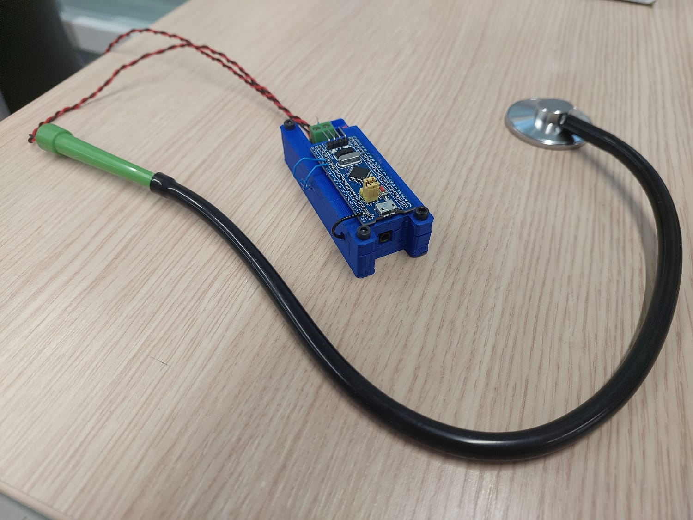

# 🔬 SAPA Project

📊 A real-time heart and lung signal analysis tool built with MATLAB App Designer, providing advanced signal processing and visualization capabilities.

## 📋 Overview

SAPA Project is a complicated GUI application that enables real-time analysis and visualization of heart and lung signals. Built using MATLAB App Designer, it offers comprehensive features for signal processing, filtering, and frequency analysis, making it an essential tool for biomedical signal processing researchers and enthusiasts.

## ⭐ Features

### 📡 Signal Acquisition
- Real-time data acquisition through serial port connection
- Simultaneous display of heart and lung signal plots

### ⚙️ Signal Processing
- Multiple filter types supported:
  - Low-pass
  - High-pass
  - Band-pass
  - Band-stop
- Configurable filter order and frequency limits

### 📈 Visualization
- Dual display of raw and filtered signal plots
- Real-time frequency analysis visualization
- Customizable scaling for time and frequency domain plots

### 📊 Analysis
- Real-time heart rate (BPM) computation
- Live breathing rate monitoring
- Dynamic signal analysis capabilities

## 🚀 Installation

### 📌 Prerequisites

- MATLAB (R2020b or later recommended)
- App Designer toolbox
- Serial port-enabled device for data input

### 📥 Setup Instructions

1. Clone the repository:
```bash
git clone https://github.com/MetehanSaman/SAPA_Project.git
```

2. Open MATLAB and navigate to the project directory
3. Launch `Project_GUI_V5_M.mlapp`
4. Run the application

## 💻 Usage

### 🔌 Serial Port Connection

1. Select your serial port from the dropdown menu
2. Click "Connect" to establish connection
3. Use "Refresh" to update available ports list

### 🎛️ Signal Filtering

1. Choose your desired filter type
2. Set the filter order
3. Define frequency limits
4. Apply filter using the "Filter" button

### 🖥️ Visualization Control

1. Adjust time and frequency domain scales
2. Use "Scale" button to update visualizations
3. Toggle between "STOP" and "Continue" for real-time monitoring

## 🎮 GUI Components

### 🎚️ Input Controls
- Serial port selection dropdown
- Comprehensive filter configuration panel
- Scale adjustment controls

### 🔘 Action Buttons
- Connect/Disconnect
- Filter application
- Start/Stop monitoring
- Display refresh
- Scale updating
- Port list refresh

### 📺 Display Elements
- Multiple UI Axes for signal visualization
- Real-time measurements display
- Status indicators

## 📦 Dependencies

Required MATLAB Toolboxes:
- Signal Processing Toolbox

## 📄 License

See the [LICENSE](LICENSE) file for details.

## Picture of the Project



